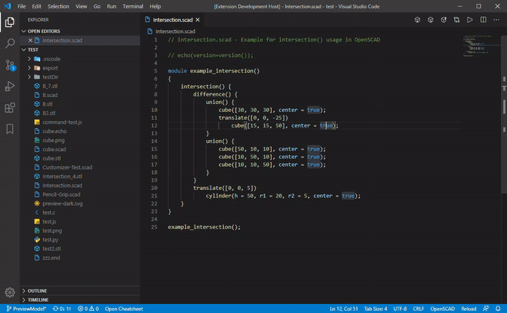
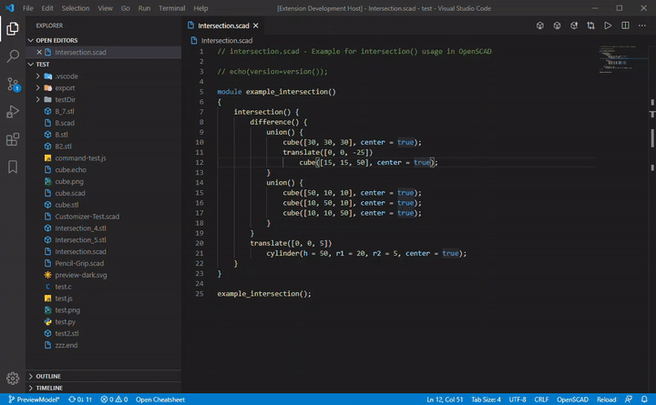

# OpenSCAD for VS Code

Edit OpenSCAD files with all the luxuries of VSCode! Works with OpenSCAD v2019.05.

Project is available at: <https://github.com/Antyos/vscode-openscad>

This extension builds upon the "scad" extension by `Erik Benson` and later expanded upon by GitHub user `atnbueno` <https://github.com/atnbueno/vscode-lang-scad>

## Features

This extension features:

- Syntax highlighting for:
    - Built-in OpenSCAD and user modules/functions
    - Includes customizer syntax support for Drop down boxes, Sliders, and Tabs
- Preview and Export buttons to Preview/Export files with a single click
- Snippets
- Built-in access to the OpenSCAD cheatsheet

## Highlighting comparison

VSCode with OpenSCAD Plugin| OpenSCAD Editor
:-------------------------:|:-------------------------:
 | 

Code: <https://files.openscad.org/examples/Basics/intersection.html>

## Customizer Syntax

Highlights customizer keywords in comments! As of OpenSCAD v2019.5, OpenSCAD itself does not currently do this.


## Preview Files

Click the **Preview in OpenSCAD** button to instantly launch and preview your file in OpenSCAD!

Check [**usage**](#usage) section for more information.



## Export Files

Click the **Export Model** button to export your model to any of the supported file types! (`stl`, `3mf`, `dxf`, etc.)

You can also set a naming scheme to automatically name exported files. See [Auto-Exporting](https://github.com/Antyos/vscode-openscad/wiki/Auto-Exporting).



## Built-in Cheatsheet

Launch the built-in OpenSCAD cheatsheet with the command `Open OpenSCAD Cheatsheet` or with the button in the status bar!


## Usage

**Make sure you have installed OpenSCAD here:** <https://www.openscad.org/downloads.html>

If you install OpenSCAD to the default location for you system, the extension should automatically detect it. If not, you will need to set the `openscad.launchPath` configuration option in **Settings > Extensions > OpenSCAD > Launch Path** or by adding the following line to your `settings.json` file:

``` json
{
    "someSetting": "",
    "openscad.launchPath": "path/to/openscad"
}
```

> _Note: If you are using Windows, make sure to specify the path to `openscad.exe` so the extension can properly manage open previews and exports._

To preview a `.scad` file, you can use the **Preview in OpenSCAD** command which can be accessed via the Command Pallette, the button in the editor title bar, or by right clicking the file in the title bar or explorer and choosing it from the context menu.

In OpenSCAD, make sure to have **Automatic Reload and Preview** checked under **Design > Automatic Reload and Preview**. You may also want to hide the editor and customizer panels in OpenSCAD by checking **View > Hide Editor** and **View > Hide Customizer**.

When you save your file in VSCode, OpenSCAD will automatically reload and preview the updated file.

For more information, see: [Using an external Editor with OpenSCAD](https://en.wikibooks.org/wiki/OpenSCAD_User_Manual/Using_an_external_Editor_with_OpenSCAD)

## To-Do

- Add OpenSCAD logo for `.scad` file extensions once that becomes a feature in VSCode. See [microsoft/vscode#14662](https://github.com/microsoft/vscode/issues/14662).
- Add to syntax highlighting
- Auto-naming export
    - Include ${var:x} in export format
    - Add "export" line in .scad file to override export filename settings on per-file basis
    - Add configurable export map for each file format
    - Launch file with args (get user input for args)
- Add snippets for common things in the OpenSCAD cheat sheet
- Create language server
    - _Parameters in functions should be highlighted in contents as well_
    - _Block comment new lines keep '*' at the beginning of the line (comment continuation patterns)_
    - _Recognize modifier characters (* ! # %)_
- _Create shortcut to open `.scad` files with VSCode by default but has OpenSCAD icon_
- _Extension auto-installs its own copy of OpenSCAD_

> _Note: Italicized items on the to-do list are more challenging and I do not know when (if ever) I will get to them._

## Changelog

See the changelog [here](https://github.com/Antyos/vscode-openscad/blob/master/CHANGELOG.md).

## Contributing

I made this extension because I like OpenSCAD and there wasn't any language support in VS Code I liked. I currently maintain this extension as a side project, so I can't promise when I will get to adding new features. With that being said, please feel free to submit a pull request!

If you would like to contribute, here's what you can do:

1. Fork the repository: <https://github.com/Antyos/vscode-openscad.git>
2. Run `npm ci` to download node modules (without updating `package-lock.json`)
3. If running the extension in debug mode, make sure to rename `.vscode/launch.template.json` to `.vscode/launch.json`
4. Make changes
5. Submit a pull request!

### Contributing to the Grammar

VSCode can only read tmLanguage files in `xml` or `json` format. If you want to make changes to the grammar in the `.yaml-tmlanguage` file, you will need to convert it to `.json` before VSCode can use it.

Assuming you have followed the steps above to obtain a local copy of the extension, run the `update-grammar` script to convert `syntaxes/scad.yaml-tmlanguage` to `syntaxes/scad.tmlanguage.json`
