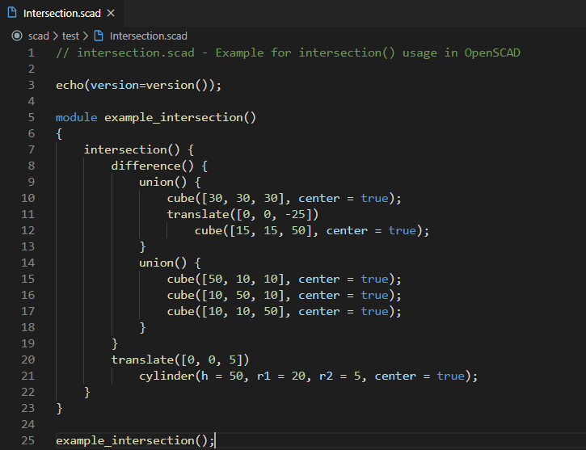
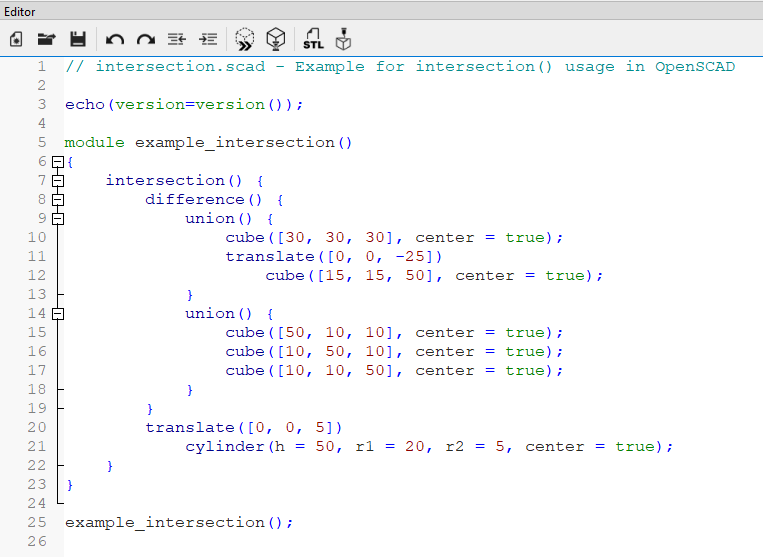
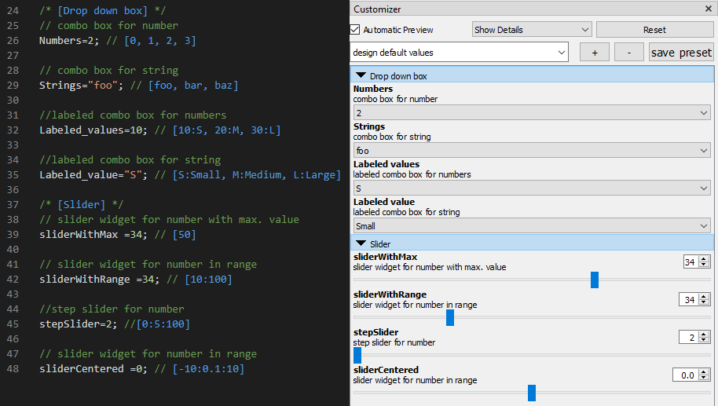
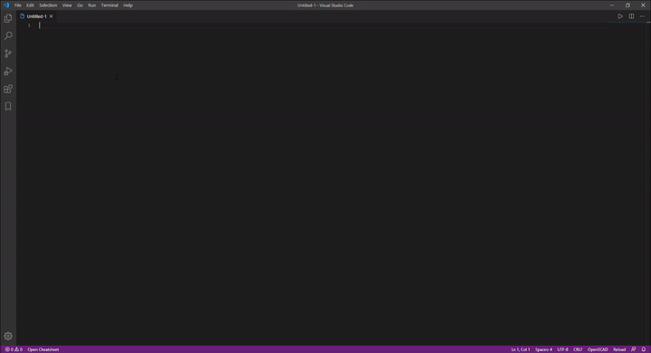

# OpenSCAD Extension

Edit OpenSCAD files with all the luxuries of VSCode! Works with OpenSCAD v2019.05.

Project is available at: https://github.com/Antyos/vscode-openscad

This extension builds upon the "scad" extension by `Erik Benson` and later expanded upon by GitHub user `atnbueno` (https://github.com/atnbueno/vscode-lang-scad)

## Features
This extension features:
- Syntax highlighting for
   - Built-in OpenSCAD and user modules/functions
   - Includes customizer syntax support for Drop down boxes, Sliders, and Tabs
- Snippets
- Built-in access to the OpenSCAD cheatsheet

## Highlighting comparison
VSCode with OpenSCAD Plugin| OpenSCAD Editor
:-------------------------:|:-------------------------:
 | 

Code: https://files.openscad.org/examples/Basics/intersection.html

## Customizer Syntax
Highlights customizer keywords in comments! As of OpenSCAD v2019.5, OpenSCAD itself does not currently do this.


## Built-in Cheatsheet
Launch the built-in OpenSCAD cheatsheet with the command `Open OpenSCAD Cheatsheet` or with the button in the status bar!



# Usage
**Make sure you have installed OpenSCAD here:** https://www.openscad.org/downloads.html

Open your `.scad` file in both VSCode and in OpenSCAD.

In OpenSCAD, make sure to have `Automatic Reload and Preview` checked under `Design > Automatic Reload and Preview`. You may also want to hide the editor and customizer panels in OpenSCAD by checking `View > Hide Editor` and `View > Hide Customizer`.

When you save your file in VSCode, it will automatically reload and preview in OpenSCAD.

For more information, see: [Using an external Editor with OpenSCAD](https://en.wikibooks.org/wiki/OpenSCAD_User_Manual/Using_an_external_Editor_with_OpenSCAD)

## Code Runner support
Until previewing is built into this extension, you can use Code Runner by formulahendry. To add support support for Code Runner, add the following to your `settings.json` file:

```
"code-runner.executorMap": {
    "scad": "\"C:\\Program Files\\openscad\\openscad.exe\""
},
```
> Note: If you installed OpenSCAD to another location, use that instead.


## To-Do
- Add OpenSCAD logo for `.scad` file extensions once that becomes a feature in VSCode 
(See [Issue: 14662](https://github.com/microsoft/vscode/issues/14662)).
- Add to syntax highlighting
   - _Support for modifier characters (* ! # %)_
   - _Parameters in functions should be highlighted in contents as well_
- Add "Preview with OpenSCAD" button (Opens and previes the file in OpenSCAD)
   - Add option for custom OpenSCAD installation director
   - Contributes menu to preview any .scad file
   - _Extension auto-installs its own copy of OpenSCAD_
- Add snippets for common things in the OpenSCAD cheat sheet
- _Add peek/jump definition for symbols_
- _Have VSCode recognize function parameters in IntelliSense_
- _Block comment new lines keep '*' at the beginning of the line_
- _Create shortcut to open `.scad` files with VSCode by default but has OpenSCAD icon_

> _Note: Italicized items on the to-do list are more challenging and I do not know when (if ever) I will get to them._

## Changelog
See the changelog [here](https://github.com/Antyos/vscode-openscad/blob/master/CHANGELOG.md).

## Contributing
I made this extension because I like OpenSCAD and there wasn't any language support in VS Code I liked. I will try and keep this extension up to date in the future, but I make no promises.

If you would like to contribute, here's what you can do:
 1. Fork the repository: https://github.com/Antyos/vscode-openscad.git
 2. Run `npm install` to download node modules
 3. Make changes
 4. Submit a pull request!

### Contributing to the Grammar
If you want to make changes to the grammar in the `.yaml-tmlanguage` file, you will need to convert it to `.json` before VSCode can use it. 

Run: `npm install` to download `js-yaml` for the conversion process. 

After that, you can run: `npx js-yaml syntaxes/scad.yaml-tmLanguage > syntaxes/scad.tmLanguage.json`. Or, just run `makescad.bat` to convert `syntaxes/scad.yaml-tmlanguage` to `syntaxes/scad.tmlanguage.json`