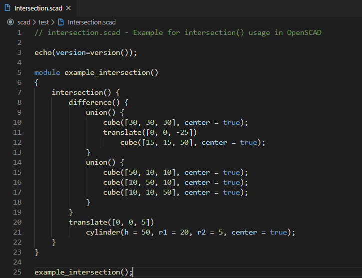
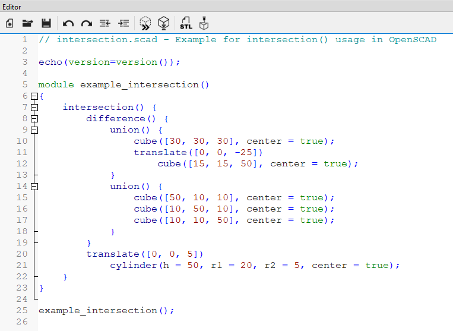

# OpenSCAD Extension

Edit OpenSCAD files with all the luxuries of VSCode! Works with OpenSCAD v2019.05.

Project is available at: https://github.com/Antyos/vscode-openscad

This extension builds upon the "scad" extension by `Erik Benson` and later expanded upon by GitHub user `atnbueno` (https://github.com/atnbueno/vscode-lang-scad)

## Features
This extension features:
- Syntax highlighting for built-in OpenSCAD and user modules/functions
- Snippets

## Highlighting comparison
VSCode with OpenSCAD Plugin| OpenSCAD Editor
:-------------------------:|:-------------------------:
 | 

Code: https://files.openscad.org/examples/Basics/intersection.html

# Usage
**Make sure you have installed OpenSCAD here:** https://www.openscad.org/downloads.html

Open your `.scad` file in both VSCode and in OpenSCAD.

In OpenSCAD, make sure to have `Automatic Reload and Preview` checked under `Design > Automatic Reload and Preview`. You may also want to hide the editor and customizer panels in OpenSCAD by checking `View > Hide Editor` and `View > Hide Customizer`.

When you save your file in VSCode, it will automatically reload and preview in OpenSCAD.

## Code Runner support
Until previewing is built into this extension, you can use Code Runner by formulahendry. To add support support for Code Runner, add the following to your `settings.json` file:

```
"code-runner.executorMap": {
    "scad": "\"C:\\Program Files\\openscad\\openscad.exe\""
},
```
Note: If you installed OpenSCAD to another location, use that instead.


## To-Do
- Add OpenSCAD logo for `.scad` file extensions once that becomes a feature in VSCode 
(See [Issue: 14662](https://github.com/microsoft/vscode/issues/14662)).
- Add to syntax highlighting
   - Customizer syntax support (See: https://en.wikibooks.org/wiki/OpenSCAD_User_Manual/Customizer)
   - _Add support for modifier characters (* ! # %)_
   - _Parameters in functions should be highlighted in contents as well_
- Add "Preview with OpenSCAD" button (Opens and previes the file in OpenSCAD)
   - Add option for custom OpenSCAD installation director
   - _Extension auto-installs its own copy of OpenSCAD_
- Add "Open OpenSCAD Cheat sheet" button because why not
   - Include the html page in the extension for ease of access
- Add snippets for common things in the OpenSCAD cheat sheet
- _Add peek/jump definition for symbols_
- _Have VSCode recognize function parameters in IntelliSense_
- _Block comments line returns keep '*' at the beginning of lines_
- _Add shortcut to open `.scad` files with VSCode by default but has OpenSCAD icon_

> _Note: Italicized items on the to-do list are more challenging and I do not know when (if ever) I will get to them._
> 
> Most of the features that I'm working on are features that ***I*** personally want in this extension. If you want to add something that I don't plan on getting around to, feel free to make a pull request.

## Notes
I made this extension because I like OpenSCAD and there wasn't any language support in VS Code I liked. While I will try and keep this extension up to date, I make no promises. As is, it has taken me months (on and off) to learn RegEx and TextMate grammars to develop the syntax highlighting.

If you want to make changes to the grammar in the `.yaml-tmlanguage` file, you will need to convert it to `.json` before VSCode can use it. 

Run: `npm install` to download `js-yaml` for the conversion process. 

After that, you can run: `npx js-yaml syntaxes/scad.yaml-tmLanguage > syntaxes/scad.tmLanguage.json`. Or, just run `makescad.bat` to convert `syntaxes/scad.yaml-tmlanguage` to `syntaxes/scad.tmlanguage.json`